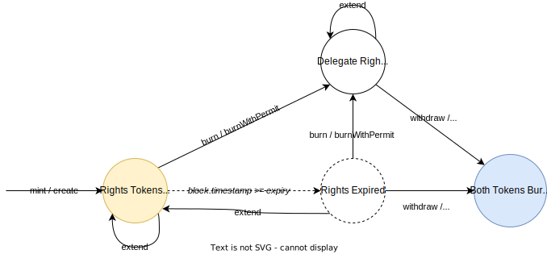

# Liquid Delegate V2

Liquid Delegate is a protocol that allows you to tokenize the delegation rights of your tokens.
Liquid Delegate V2 (or "LD v2" for short) is a dual token system: There's the delegate token that
tokenizes the ERC5639 delegation rights of the underlying token and the principal token which
tokenizes the right to withdraw the underlying after expiry.

## Contracts
Describes the upper-level contracts.

- [LiquidDelegateV2](./src/LiquidDelegateV2.sol): Manages the core delegate rights, stores the
  underlying NFTs and keeps track expiries.
- [PrincipalToken](./src/PrincipalToken.sol): Keeps track of the principal rights
- [WrapOfferer](./src/WrapOfferer.sol): Seaport contract offerer to allow for direct creation and
  sale of delegate tokens as part of an order

## Technical Details

### Principal-Delegate Token Duality

Unlike V1, Liquid Delegate V2 is a dual token system. Not only does V2 tokenize the delegation
rights as transferrable, tradeable ERC721 tokens but also tokenizes the right to withdraw the
underlying token once the rights expire. In V1 this right would remain fixed and assigned to the
original `depositor` until the claim expired. Tokenization of the "right to principal" allows for
the underlying token to still be traded, transferred and sold while the underlying token is locked
in the `LiquidDelegateV2` contract. The delegate rights tokens or just "delegate tokens" for short
are tracked in the `LiquidDelegateV2` contract and the principal rights tokens are tracked in the
`PrincipalToken` contract, together they'll be referred to as "rights tokens".



Diagram: The state and transitions of a pair of rights.

> **WARNING:** The delegate token will be **force burned** when the principal holder redeems their
token after the rights expire. Make sure you only deposit your delegate token into secondary
contracts for the duration of the expiry to avoid certain protocol / lending positions that might
expect all deposited tokens to be transferrable.

### The Rights ID System
Rights IDs are used to uniquely identify the rights tokens associated to different delegation
& principal rights. The delegation and principal tokens for a given underlying share the same ID and
are differentiated by the different contract address they live under. Rights IDs are deterministic
and composed of the "base rights ID" and 56-bit nonce. The base rights ID is determined by the underlying
token contract address and token ID:

```solidity
uint256 BASE_RIGHTS_ID_MASK = 0xffffffffffffffffffffffffffffffffffffffffffffffffff00000000000000;
uint256 baseRightsId = uint(keccak256(abi.encode(tokenContract, tokenId))) & BASE_RIGHTS_ID_MASK;
uint56 nonce;
uint256 rightsId = baseRightsId | nonce;
```

The ID is derived this so that:
1. All rights IDs are unique.
2. They can easily be linked together.
3. Deriving the base rights ID from the rights ID requires no context.

The nonce of a given base rights ID is only incremented once the underlying token is withdrawn using
`withdraw` or `withdrawTo`.

### Creating rights: `mint` vs. `create`
Both `mint` and `create` accept the same set of parameters:
- `address delegateRecipient`
- `address principalRecipient`
- `address tokenContract`
- `uint256 tokenId`
- `ExpiryType expiryType`
- `uint256 expiryValue`

The core difference between `mint` and `create` is how they expect the underlying token to be
deposited. `create` pulls the underlying token using `token.transferFrom(msg.sender, this, tokenId)` as
part of the same call ensuring that both contracts and EOAs can safely use the method without risk
of a race condition once they've approved the contract. `mint` is different, it expects the token to
have already been transferred in advance (and not already locked) to the `LiquidDelegateV2`
contract. Therefore EOAs cannot safely use this method with encountering the risk of being frontrun
as sending an NFT to the contract in an initial transaction would allow anyone to claim it via `mint`.

**Why even have `mint`?**
Mint is useful for contracts to save gas if they want to add some extra logic or validation around
rights creation:

```solidity
// Using `create`:
function createBased(address token, uint id) external {
    IERC721(token).transferFrom(msg.sender, address(this), id);
    IERC721(token).approve(address(liquidDelegate), id);
    liquidDelegate.create(...);
}

// Using `mint`:
function mintBased(address token, uint id) external {
    IERC721(token).transferFrom(msg.sender, address(liquidDelegate), id);
    liquidDelegate.mint(...);
}
```

In the above example gas is not only saved by avoiding the added `approve` but also by ensuring that
the token is only transferred once, directly from the `msg.sender` to `liquidDelegate` rather than
in 2-hops. This functionality is also leveraged by the [WrapOfferer](./src/WrapOfferer.sol) to allow
for Seaport to transfer the underlying token into the Liquid Delegate V2 separately from the actual
rights creation.

### Seaport-based Rights Creation via [WrapOfferer](./src/WrapOfferer.sol)
The `WrapOfferer` contract is a Seaport "contract offerer" that facilitates the creation of V2
delegation rights directly via Seaport orders. This is done via the `CONTRACT` order type which
allows contracts to dynamically create orders on the fly based on arbitrary data via a standardized
interface.

Like any participant in a Seaport order contract offerers also have offers (items they give up) and
considerations (items they expect to receive / others to receive) for their orders to validated. The
core order generated by the `WrapOfferer` is very simple:

**Offer items (n >= 1):**
- _Wrap Receipt_ (can issue as many identical receipts as desired)

**Consideration items (1):**
- Expect the `LiquidDelegateV2` contract to receive the underlying token to be wrapped i.e. locked
